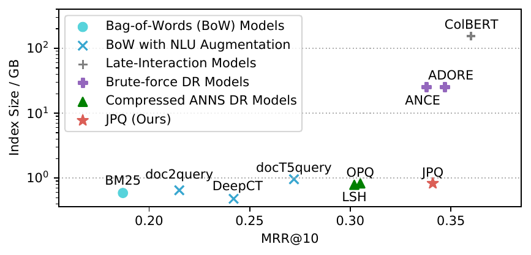
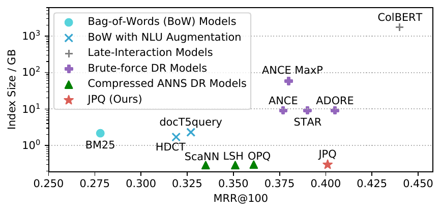
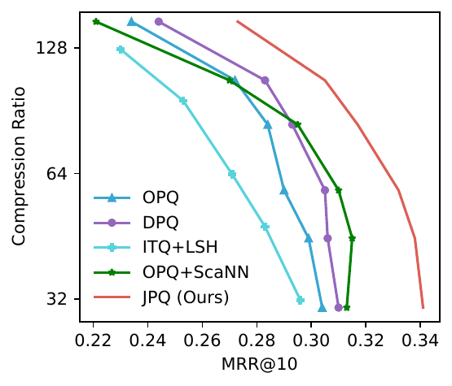
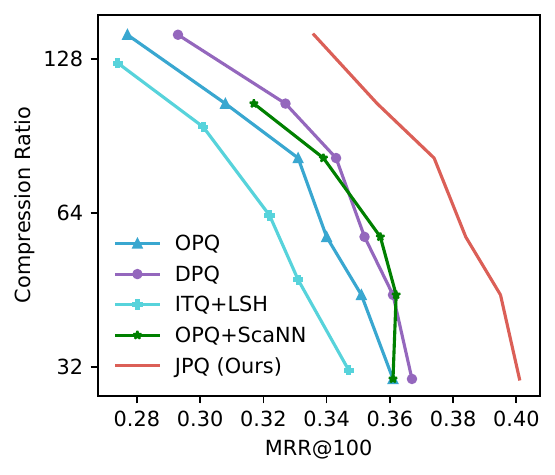

# JPQ

Repo for our paper, [Jointly Optimizing Query Encoder and Product Quantization to Improve Retrieval Performance](https://arxiv.org/abs/2108.00644), by [Jingtao Zhan](https://scholar.google.com/citations?user=VWE8-akAAAAJ&hl=en), [Jiaxin Mao](https://sites.google.com/site/maojiaxin/), [Yiqun Liu*](http://www.thuir.cn/group/~YQLiu/), [Jiafeng Guo](http://www.bigdatalab.ac.cn/~gjf/), [Min Zhang](http://www.thuir.cn/group/~mzhang/), Shaoping Ma.

We are excited to present our new model, JPQ. It almost matches the uncompressed Dense Retrieval counterpart with 30x compression on index size. The compressed index further brings 10x speedup on CPU and 2x speedup on GPU in query latency. 

## Comparison with First-Stage Retrieval Baselines
Here is the effectiveness - index size (log-scale) tradeoff on MSMARCO Passage Ranking. The index size of JPQ is only 1/186 of the size of ColBERT.

Here is the effectiveness - index size (log-scale) tradeoff on MSMARCO Document Ranking. The index size of JPQ is only 1/5833 of the size of ColBERT.

Although existing neural retrieval models, i.e., brute-force DR models and late-interaction models, are more effective than BoW models, they significantly increase the index size by several orders of magnitude. When the indexes of brute-force DR models are compressed by LSH or OPQ, the retrieval effectiveness is severely hurt. Therefore, the results seem to imply that large index sizes are necessary for high-quality ranking.

**In contrast with trading index size for ranking performance, JPQ achieves high ranking effectiveness with a tiny index.**
It outperforms BoW model by a large margin with similar or even much smaller index sizes. It gains similar ranking performance with state-of-the-art brute-force DR models while substantially compressing the index. 
Although ColBERT is more effective than JPQ, it is inefficient in both memory and latency. In our paper, we demonstrate that JPQ + BERT substantially outperforms ColBERT with much smaller query latency. 

## Comparison with Compression Baselines
Results at different trade-off settings shown below.

MS MARCO Passage Ranking   |  MS MARCO Document Ranking
:-------------------------:|:-------------------------:
  |  

JPQ is still very effective even if the compression ratio is over 100x and outperforms baselines at all tradeoff settings. 

## Comparison with Non-exhaustive ANNS Baselines
Non-exhaustive ANNS Baselines do not compress the index. Impressively, JPQ significantly outperforms them given the same query latency. Please refer to our paper for more details. 

Code and trained models will be available soon.
